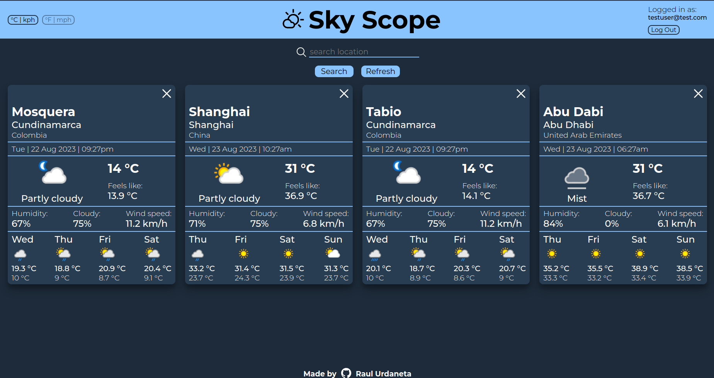

# weather app

# Functionality

- Create an account by signing up.
- log in and log out to your account.
- Add a city to see its weather conditions at the time.
- Remove any city you don't want to see info about.
- See forecast maximum and minimum temperatures for next 4 days.
- See relevant climate info about the city, like temperature, thermal sensation, humidity, wind speed, and cloud percentage.
- Refresh the weather info to the latest update.

# My learnings
- Used async functions to make API requests.
- Used try catch to make the request and handle errors.
- Used await to handle the API response to make code look synchronic.
- Used promises to use some of the async functions.
- Handled weather API responses to display info wit DOM.
- Learned to handle API response info.
- Used firebase API to handle authentication with mail and password, or using google account.
- Used firestore database to store users with an array of the cities they want to see the weather, and their unit system preferences.
- Used onAuthStateChanged to check if user was logged in to display correct UI.
- Created a function to handle errors from async functions.

[Live Preview](https://raulurdanetag.github.io/weather-app) 👈
